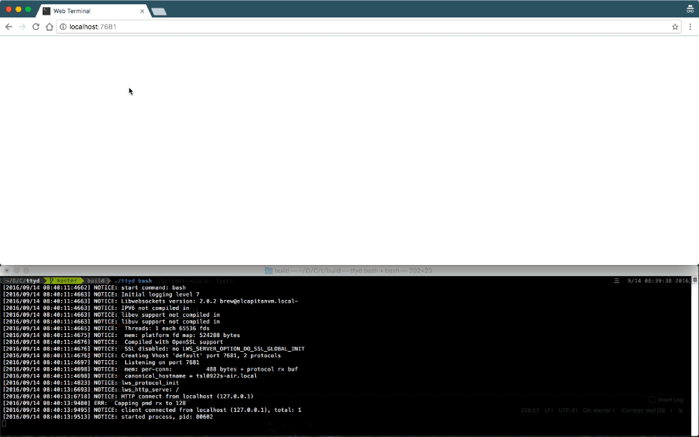

# ttyd - Share your terminal over the web [](https://travis-ci.org/tsl0922/ttyd)

ttyd is a simple command-line tool for sharing terminal over the web, inspired by [GoTTY](https://github.com/yudai/gotty).



# Features

- Build on [libwebsockets](https://libwebsockets.org) with C for speed
- Full terminal emulation based on [hterm](https://chromium.googlesource.com/apps/libapps/+/HEAD/hterm)
- SSL support based on [OpenSSL](https://www.openssl.org)
- Run any custom command with options
- Basic authentication support
- Cross platform: macOS, Linux, [OpenWrt](https://openwrt.org)/[LEDE](https://www.lede-project.org)

# Installation

## Install on macOS

Install with [homebrew](http://brew.sh):

```bash
brew tap tsl0922/ttyd
brew install ttyd
```

## Install on Linux

Ubuntu 16.04 as example:

```bash
sudo apt-get install cmake g++ pkg-config git vim-common libwebsockets-dev libjson-c-dev libssl-dev
git clone https://github.com/tsl0922/ttyd.git
cd ttyd && mkdir build && cd build
cmake ..
make && make install
```

> **NOTE:** You may need to compile libwebsockets from source for ubuntu versions old than 16.04, since they have outdated `libwebsockets-dev` package ([Issue #6](https://github.com/tsl0922/ttyd/issues/6)).

## Install on OpenWrt/LEDE

```bash
opkg install ttyd
```

> **NOTE:** This may only works for [LEDE](https://www.lede-project.org) snapshots currently, if the install command fails, compile it yourself.

# Usage

```
ttyd is a tool for sharing terminal over the web

USAGE:
    ttyd [options] <command> [<arguments...>]

VERSION:
    1.1.0

OPTIONS:
    --port, -p              Port to listen (default: 7681)
    --interface, -i         Network interface to bind
    --credential, -c        Credential for Basic Authentication (format: username:password)
    --uid, -u               User id to run with
    --gid, -g               Group id to run with
    --signal, -s            Signal to send to the command when exit it (default: SIGHUP)
    --reconnect, -r         Time to reconnect for the client in seconds (default: 10)
    --readonly, -R          Do not allow clients to write to the TTY
    --check-origin, -O      Do not allow websocket connection from different origin
    --once, -o              Accept only one client and exit on disconnection
    --ssl, -S               Enable ssl
    --ssl-cert, -C          Ssl certificate file path
    --ssl-key, -K           Ssl key file path
    --ssl-ca, -A            Ssl ca file path
    --debug, -d             Set log level (0-9, default: 7)
    --version, -v           Print the version and exit
    --help, -h              Print this text and exit
```

ttyd starts web server at port `7681` by default, the `command` will be started with `arguments` as options. For example, run:

```bash
ttyd bash
```
Then open <http://localhost:7681>, now you can see and control the `bash` console on your web broswer! :tada: 

> **TIP:** You may replace `bash` with `login` to get a login prompt first.

# Credits

- [GoTTY](https://github.com/yudai/gotty): ttyd is a port of GoTTY to `C` language.
- [hterm](https://chromium.googlesource.com/apps/libapps/+/HEAD/hterm): ttyd uses hterm to run a terminal emulator on the web.